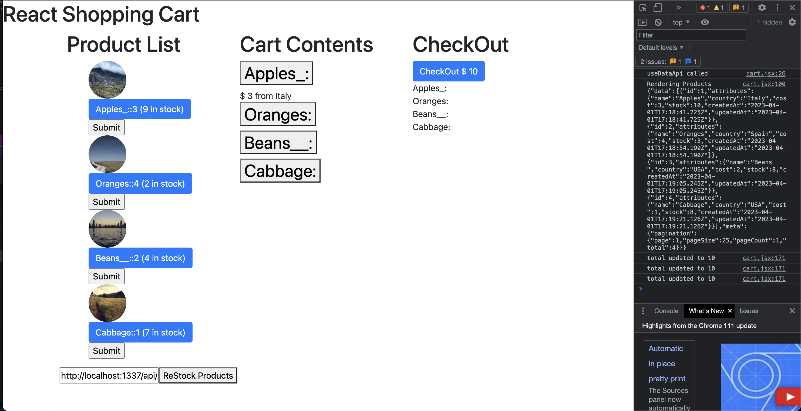

# Shopping Cart Restocking Exercise

## Project Overview

Solution for the checkout cart project where stock data is fetched from Strapi when the restock button is selected. This clears the cart of selected items and updates stock levels to the JSON data. 

## How to Run
1. Launch strapi server containing products by entering: npm run-script develop
2. Navigate to project root in terminal
3. run http-server
4. open the localhost server on your preffered browser and ensure the restock's link is to the strapi products page

## License

[MIT License](LICENSE)
